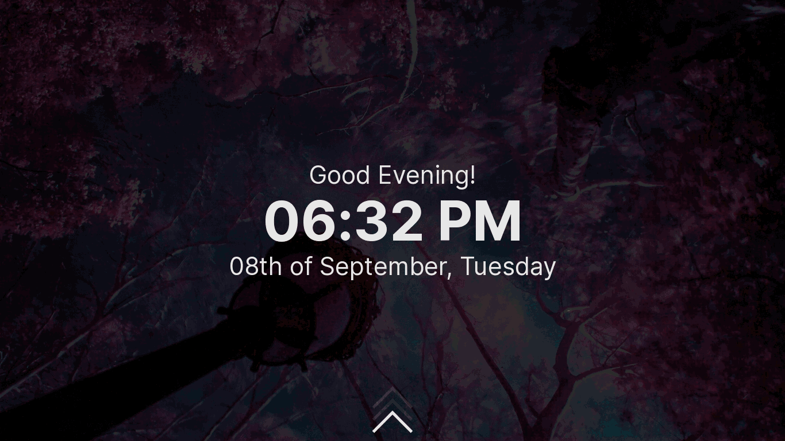
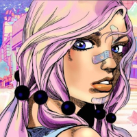

## glorious - a lightdm webkit2 theme

[](https://github.com/manilarome/the-glorious-lightdm-webkit2-theme/commits/master) [](https://github.com/manilarome/the-glorious-lightdm-webkit2-theme/pulls) [](http://hits.dwyl.com/manilarome/the-glorious-lightdm-webkit2-theme) [](https://www.codacy.com?utm_source=github.com&amp;utm_medium=referral&amp;utm_content=manilarome/the-glorious-lightdm-webkit2-theme&amp;utm_campaign=Badge_Grade)

A sleek, modern, and glorified lightdm webkit2 theme

## [Live Demo](https://manilarome.github.io/lightdm-webkit2-theme-glorious)

### Demo password: `toor`

<p align='center'><br/><i>glorious - a lightdm webkit 2 theme</i></p>

### Dependencies

Please make sure you don't have an ancient version of these.

+ [lightdm](https://wiki.archlinux.org/title/LightDM#Installation)
+ [lightdm-webkit2-greeter (aur/lightdm-webkit2-greeter )](https://github.com/Antergos/lightdm-webkit2-greeter)


### Installation

0. If you're using `systemd`, make sure that `lightdm.service` or `lightdm-plymouth.service` is enabled and running. There's a bunch of guides on the internet. [Archwiki](https://wiki.archlinux.org/index.php/LightDM) is recommended.

1. Install it. You can get the theme by cloning this repo or by installing it from `AUR` using `makepkg` or an AUR helper like `yay`.

	+ AUR route.

		```sh
		# AUR Helper
		yay -Syu lightdm-webkit2-theme-glorious

		# Makepkg route
		git clone https://aur.archlinux.org/lightdm-webkit2-theme-glorious.git
		cd lightdm-webkit2-theme-glorious
		makepkg -sri
		```

	+ Clone the repo route.

		1. Download and extract the latest stable release from [here](https://github.com/manilarome/lightdm-webkit2-theme-glorious/releases).
		2. Copy it to the lightdm-webkit theme folder:

			```sh
			cp -r lightdm-webkit2-theme-glorious /usr/share/lightdm-webkit/themes/glorious
			```

3. Set lightdm greeter session to webkit2.

	```sh
	# Set default lightdm greeter to lightdm-webkit2-greeter
	sudo sed -i 's/^\(#?greeter\)-session\s*=\s*\(.*\)/greeter-session = lightdm-webkit2-greeter #\1/ #\2g' /etc/lightdm/lightdm.conf
	```

4. Set it as the lightdm webkit2 theme then enable `debug_mode` by setting it to `true`. Why do we need to enable `debug_mode`? Sometimes you will be greeted by an error. And this error is due to a race condition where the theme is trying to access the `lightdm` object even though it doesn't exist *yet*. Debug mode will allow you to `right-click` and `reload` the greeter just like a webpage.

	```sh
	# Set default lightdm-webkit2-greeter theme to Glorious
	sudo sed -i 's/^webkit_theme\s*=\s*\(.*\)/webkit_theme = glorious #\1/g' /etc/lightdm/lightdm-webkit2-greeter.conf
	sudo sed -i 's/^debug_mode\s*=\s*\(.*\)/debug_mode = true #\1/g' /etc/lightdm/lightdm-webkit2-greeter.conf
	```
	
### Change the Avatar



Once LightDM, LightDM Webkit Greeter, and Aether are installed you will need to set an avatar image for your users. Size is irrelevant, and avatars will be displayed as a 125x125 circle (Yes, square images too). Users that don't have an avatar set will default to the [avatar](./assets/profiles/user.svg).

To accomplish this, you can do either of the following:
- Create an image in your home directory named `.face` or in `/var/lib/AccountsService/icons/username.png`.
- Append `Icon=/path/to/your/avatar.png` to the bottom of the file at `/var/lib/AccountsService/users/<youraccountname>`

_Examples:_ https://github.com/manilarome/lightdm-webkit2-theme-glorious/tree/master/assets/profiles

For more information: 
- Archlinux: [LightDM - Avatar](https://wiki.archlinux.org/title/LightDM#Changing_your_avatar)

**Note:** If the avatar does not change when you put the file in the folder, just go to the users section select another user (or the same user) and the change will appear.

### Uninstall

1. Follow the [installation instruction](#installation) in reverse order.

### Features

+ Multi-user support
+ Customization and Settings
+ Keyboard navigation
+ Remappable keybindings
+ Swipe gestures
+ Vanilla Javascript!

### Swipe gestures

Why do we have this? Linux can be installed on almost anything. Yes, even on a potato. So it exists to save myself some time if someone (including myself) decided to use this theme on a touch screen device (like touch screen potato? Who knows).

+ Swiping up on the greeter screen will close it.
+ Swiping down on the login screen will open the greeter screen.
+ Swiping left will open the dashboard.
+ Swiping right will close the dashboard.

### Keybinds

The default modifier is <kbd>Alt</kbd>. You can change it in the settings.

+ <kbd>Modifier + s</kbd> opens the dashboard.
+ <kbd>Modifier + e</kbd> opens the session selection.
+ <kbd>Modifier + x</kbd> opens the power selection.
+ <kbd>Modifier + y</kbd> opens the account selection.
+ <kbd>Escape</kbd> to close or go back.

### Customization and Settings

+ Color customization supports `#RGB`, `#RRGGBB`, and `#RRGGBBAA`.
+ Blur strength settings only allows an integer with `px` suffix.
+ Animation speed supports `s` and `ms`.
+ Background image selection. Supports randomness.

### Changing clock mode

There are two clock modes available - `24-hour` and `12-hour`. Switch between clock modes by just clicking on the clock. Simple.

### Notes

+ Add more background images by putting your wallpapers/images in `/usr/share/backgrounds/`.
+ Non-image and directory inside `/usr/share/backgrounds/` will cause an error! You will likely encounter this if you installed a package (for example `archlinux-wallpaper` that includes `AUTHORS` file).
+ Set your profile image in system settings or by using `mugshot`.
+ Missing DE/WM logo? Submit a [pull request](https://github.com/manilarome/lightdm-webkit2-theme-glorious/pulls)!
+ Translations are not yet supported. PR's are welcome!

### Credits

<span>Background image by <a href="https://unsplash.com/@korpa?utm_source=unsplash&amp;utm_medium=referral&amp;utm_content=creditCopyText">Jr Korpa</a> on <a href="https://unsplash.com/s/photos/cherry-blossoms-purple?utm_source=unsplash&amp;utm_medium=referral&amp;utm_content=creditCopyText">Unsplash</a></span>
