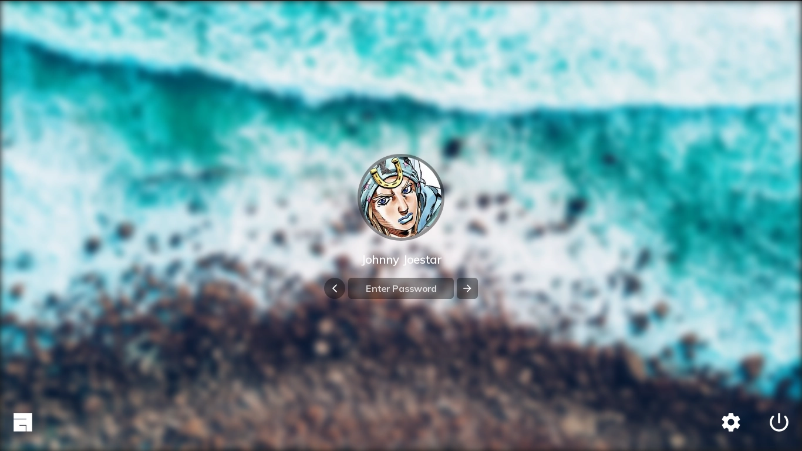
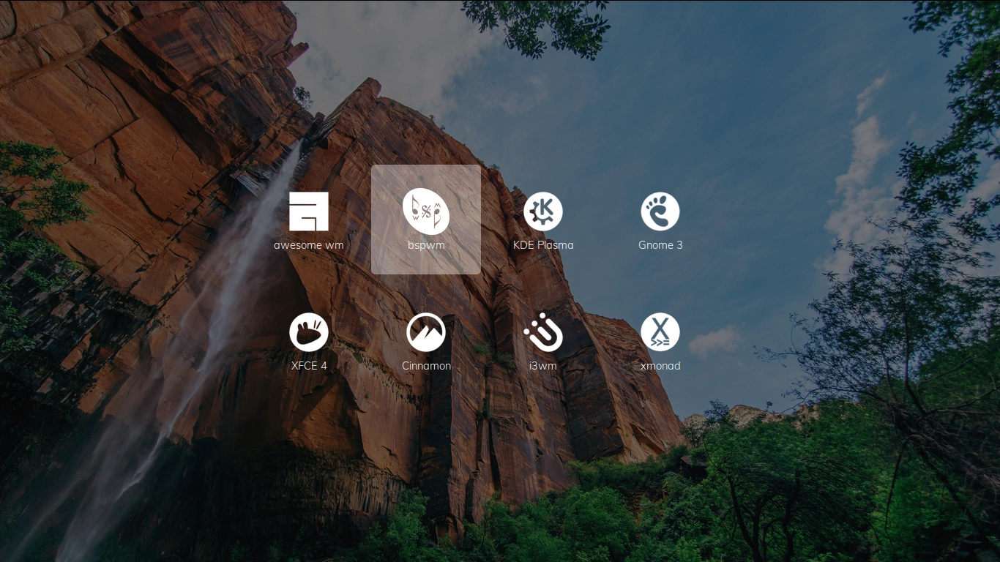
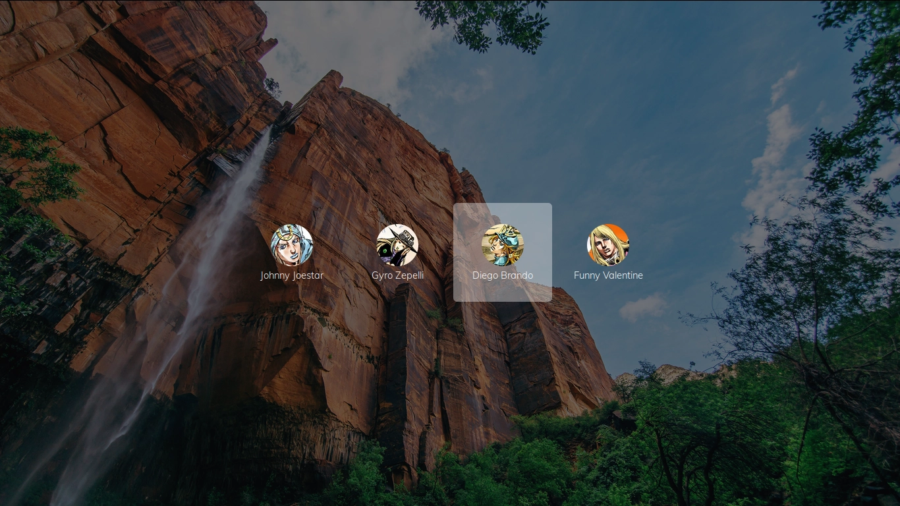
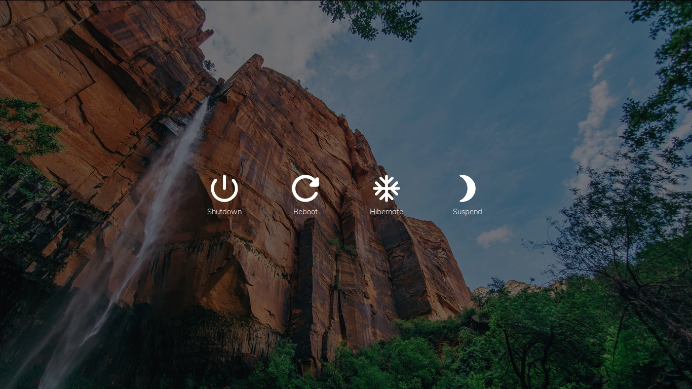

## the glorious lightdm webkit2 theme

[](https://github.com/manilarome/the-glorious-lightdm-webkit2-theme/commits/master) [](https://github.com/manilarome/the-glorious-lightdm-webkit2-theme/pulls) [](http://hits.dwyl.com/manilarome/the-glorious-lightdm-webkit2-theme) [](https://www.codacy.com?utm_source=github.com&amp;utm_medium=referral&amp;utm_content=manilarome/the-glorious-lightdm-webkit2-theme&amp;utm_campaign=Badge_Grade)

a modern, glorified lightdm webkit2 theme and pretty much work-in-progress

## [live demo here](https://manilarome.github.io/the-glorious-lightdm-webkit2-theme/)

### gallery

| login screen |
| --- |
|  |

| sessions screen |
| --- |
|  |

| users screen |
| --- |
|  |

| power screen |
| --- |
|  |


### dependencies

Make sure you have the latest version.

+ lightdm
+ lightdm-webkit2-greeter

### installation

0. If you're using systemd, make sure that `lightdm.service` or `lightdm-plymouth.service` is enabled and running. There's a bunch of guide on the internet. [Archwiki](https://wiki.archlinux.org/index.php/LightDM) is recommended.

1. Clone it.

	```
	$ git clone --depth 1 https://github.com/manilarome/lightdm-webkit2-theme-glorious
	```

2. Copy the theme to the lightdm webkit theme folder.

	```
	# cp lightdm-webkit2-theme-glorious /usr/share/lightdm-webkit/themes/ -r
	```

3. Set lightdm greeter session to webkit2.

	```
	$ sudoedit /etc/lightdm/lightdm.conf
	# Find `greeter-session`, uncomment it, then set its value to `lightdm-webkit2-greeter`.
	```

4. Set as lightdm webkit2 theme.

	```
	$ sudoedit /etc/lightdm/lightdm-webkit2-greeter.conf
	# Find `webkit_theme` then set its value to `lightdm-webkit2-theme-glorious`.
	```

### Features

Right now, the features are pretty basic. There's no settings or customization. It's just a plain old login screen. But here's the basic things it can do.

+ Multi-user support
+ Swipe gestures
+ Simple keybinding
+ Yeah, that's all to it right now. 

### Swipe gestures

+ Swiping down on the login screen will open the greeter screen.
+ Swiping right on the login screen will open the session screen.
+ Swiping left on the login screen will open the users screen.
+ Swiping up on the login screen will open the power screen.
+ Swiping up on the greeter, user, power,and session screens will close them.


### Keybinding

+ <kbd>Escape</kbd> to close the screens

### Notes

+ If you're on a desktop environment like KDE Plasma and GNOME3, you can set your profile picture and real name in the settings. While if you're on a more minimal environment like window managers, you can install and use the program called `mugshot`.
+ If your desktop environment or window manager logo is not in the sessions screen, feel free to submit a pull request!


### Credits

<span>Background image by <a href="https://unsplash.com/@wilstewart3?utm_source=unsplash&amp;utm_medium=referral&amp;utm_content=creditCopyText">Wil Stewart</a> on <a href="/?utm_source=unsplash&amp;utm_medium=referral&amp;utm_content=creditCopyText">Unsplash</a></span>