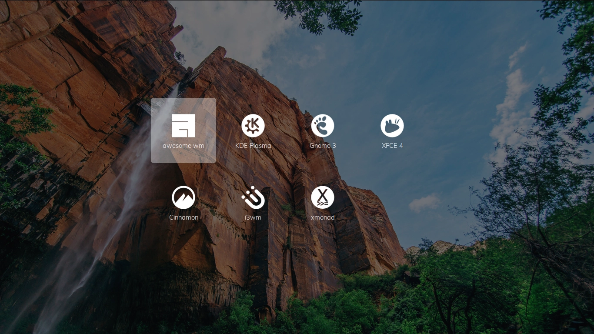

## the glorious lightdm webkit2 theme

   

a modern, glorified lightdm webkit2 theme and pretty much work-in-progress

## [live demo here](https://manilarome.github.io/the-glorious-lightdm-webkit2-theme/)

### gallery

| login screen |
| --- |
|  |

| sessions screen |
| --- |
|  |

| users screen |
| --- |
|  |

### dependencies

Make sure to have the latest version.

+ lightdm
+ lightdm-webkit2-greeter

### installation

- clone
`$ git clone --depth 1 https://github.com/manilarome/the-glorious-lightdm-webkit2-theme`

- copy it to the lightdm webkit theme folder
`# cp the-glorious-lightdm-webkit2-theme /usr/share/lightdm-webkit/themes/ -r`

- set lightdm greeter session to webkit2
`$ sudoedit /etc/lightdm/lightdm.conf`
find `greeter-session`, uncomment it, then set its value to `lightdm-webkit2-greeter`

- set the lightdm webkit2 theme
`$ sudoedit /etc/lightdm/lightdm-webkit2-greeter.conf`
find `webkit_theme` then set its value to `the-glorious-lightdm-webkit2-theme`

- Note that you need to make sure that lightdm.service is running. There's a bunch of guide on the internet.
Archwiki is recommended.

### Features

Right now, the features are pretty basic. There's no settings or customization. It's just a plain old login screen. But here's the basic things it can do.

+ Multi-user support
+ Swipe gestures
+ Yeah, that's all to it right now. 

### Swipe gestures

+ Swiping down on the login screen will open the greeter screen.
+ Swiping right on the login screen will open the session screen.
+ Swiping left on the login screen will open the users screen.
+ Swiping up on the greeter, user, and session screens will close them.

### Notes

+ If you're on a desktop environment like KDE Plasma and GNOME3, you can set your profile picture in the settings. While if you're on a more minimal environment like window managers, you can install the program called `mugshot` and set your profile image there.
