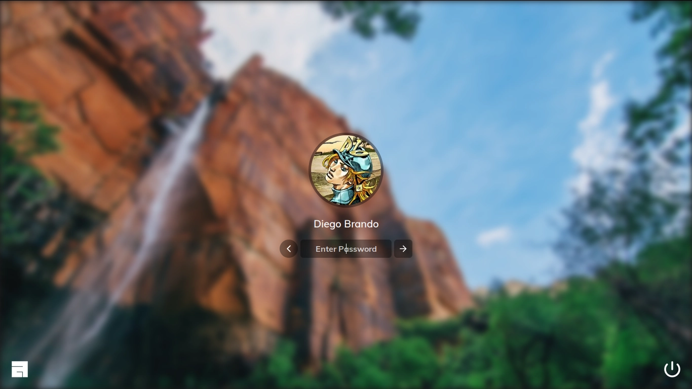

## The glorious lightdm webkit2 theme

[](https://github.com/manilarome/the-glorious-lightdm-webkit2-theme/commits/master) [](https://github.com/manilarome/the-glorious-lightdm-webkit2-theme/pulls) [](http://hits.dwyl.com/manilarome/the-glorious-lightdm-webkit2-theme) [](https://www.codacy.com?utm_source=github.com&amp;utm_medium=referral&amp;utm_content=manilarome/the-glorious-lightdm-webkit2-theme&amp;utm_campaign=Badge_Grade)

A sleek, modern, and glorified lightdm webkit2 theme

## [Live Demo](https://manilarome.github.io/lightdm-webkit2-theme-glorious)
#### Demo password: `toor`

### Gallery

| Login Screen |
| --- |
|  |

| Sessions Screen |
| --- |
|  |

| Users Screen |
| --- |
|  |

| Power Screen |
| --- |
|  |

| Settings Screen |
| --- |
|  |

| Settings background | Settings Theme | Settings Keybinds |
| --- | --- | --- |
|  |  |  |


### Dependencies

Please make sure you don't have an ancient version of these.

+ lightdm
+ lightdm-webkit2-greeter
+ an environment, a desktop environment or a window manager

### Installation

0. If you're using `systemd`, make sure that `lightdm.service` or `lightdm-plymouth.service` is enabled and running. There's a bunch of guides on the internet. [Archwiki](https://wiki.archlinux.org/index.php/LightDM) is recommended.

1. Get the theme by cloning it or by installing it from `AUR`.

+ **If you're using Archlinux**, you can install it using `makepkg` or by using an `AUR helper` like `yay`.

	```
	$ yay -S lightdm-webkit2-theme-glorious
	```
+ Clone the repository, then copy it to the `lightdm-webkit`'s `theme` folder.

	```
	$ git clone --depth 1 https://github.com/manilarome/lightdm-webkit2-theme-glorious
	# cp lightdm-webkit2-theme-glorious /usr/share/lightdm-webkit/themes/glorious -r
	```

3. Set lightdm greeter session to webkit2.

	```
	$ sudoedit /etc/lightdm/lightdm.conf
	# Find `greeter-session` under the `[Seat:*]` section, uncomment it, then set its value to `lightdm-webkit2-greeter`.
	```

4. Set it as the lightdm webkit2 theme then enable `debug_mode` by setting it to `true`. Why do we need to enable it, you say? Sometimes you will be greeted by an error. And this error is due to a race condition. Where the theme is trying to access the `lightdm` object even though it doesn't exist *yet*. Debug mode will allow you to `right-click` and `reload` the greeter just like a webpage allowing you to log-in. I don't know how to fix this yet, so yeah, PRs welcome. 

	```
	$ sudoedit /etc/lightdm/lightdm-webkit2-greeter.conf
	# Find `webkit_theme` then set its value to `glorious`.
	# Find `debug-mode` then set it to true.
	# If you encountered an error, right-click then reload.
	```

### Features

+ Multi-user support
+ Customization and Settings
+ Keyboard navigation
+ Remappable keybindings
+ Change color schemes and background image on-the-fly
+ Swipe gestures
+ Vanilla Javascript <sup>(not sure if this is a feature tho)</sup>

### Swipe gestures

Why do we have this? Linux can be installed on almost anything. Yes, even on a potato. So swipe gestures exist to save myself some time if someone decided to use this theme on a touch screen device.

+ Swiping down on the login screen will open the greeter screen.
+ Swiping right on the login screen will open the session screen.
+ Swiping left on the login screen will open the users screen.
+ Swiping up on the login screen will open the power screen.
+ Swiping up on the greeter, user, power,and session screens will close them.

### Keybinding

The default modifier is <kbd>Alt</kbd> and you can change it in the settings.

+ <kbd>Modifier + s</kbd> toggle session screen
+ <kbd>Modifier + e</kbd> toggle power screen
+ <kbd>Modifier + x</kbd> toggle settings screen
+ <kbd>Modifier + y</kbd> toggle users screen
+ <kbd>Escape</kbd> to close the screens

### Customization and Settings

#### Changing the colors, blur strength, animation speed, and background image on-the-fly

+ Open the dashboard by clicking the settings button on the dock.
+ Change the color and blur strength by setting it on the `Theme Engine` section.
+ Color settings supports `#RGB`, `#RRGGBB`, and `#RRGGBBAA`.
+ Blur strength settings only allows integer with `px` suffix.
+ Animation speed supports `s` and `ms`.
+ Background image selection.
+ Background image random selection.

### Notes

+ You can add more background images by putting your wallpapers/images in `/usr/share/backgrounds/`.
+ If you're on a desktop environment like KDE Plasma and GNOME3, you can set your profile picture and real name in the settings. While if you're on a more minimal environment like window managers, you can install and use the program called `mugshot`.
+ If your desktop environment or window manager's logo is not in the sessions screen, feel free to submit a [pull request](https://github.com/manilarome/lightdm-webkit2-theme-glorious/pulls)!

### Credits

<span>Background image by <a href="https://unsplash.com/@johnonolan?utm_source=unsplash&amp;utm_medium=referral&amp;utm_content=creditCopyText">John O'Nolan</a> on <a href="https://unsplash.com/s/photos/waves?utm_source=unsplash&amp;utm_medium=referral&amp;utm_content=creditCopyText">Unsplash</a></span>
